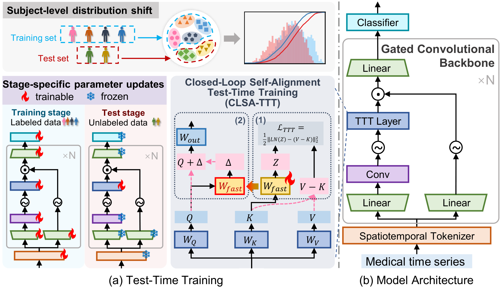
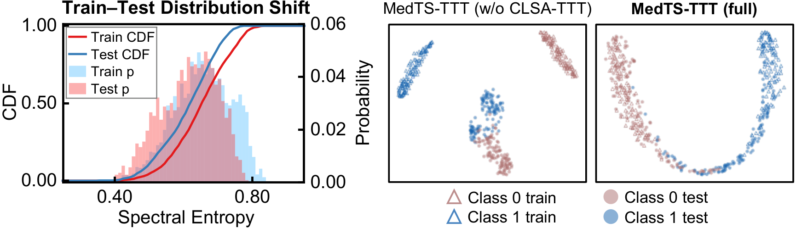

# MedTS-TTT

Official lightweight implementation of **MedTS-TTT: Test-Time Training for
Medical Time Series Classification**.

MedTS-TTT is a test-time training framework for medical time series. It targets
subject-level distribution shift in cross-subject evaluation, where samples from
the same subject should not appear in both training and test splits.

<p align="center">
  
</p>

## Highlights

- **Closed-Loop Self-Alignment Test-Time Training (CLSA-TTT)** performs a
  single-step fast-weight update from each unlabeled test sample.
- **Gated Convolutional Backbone (GCB)** combines local temporal modeling,
  sample-wise adaptation, and gated token fusion.
- **Benchmark-friendly design** follows the subject-independent MedTS setup
  used by Medformer and MedTS_Evaluation.

## Quick Start

Install the minimal dependencies:

```bash
pip install -r requirements.txt
```

Run a forward-pass demo:

```bash
python demo.py
```

Expected output:

```text
input: torch.Size([8, 12, 1000])
logits: torch.Size([8, 5])
```

## Model Usage

```python
import torch
from MedTS_TTT import MedTSTTT

# Input shape: [batch, channels, time]
x = torch.randn(8, 12, 1000)

model = MedTSTTT(
    dim=128,
    max_channel=128,
    num_heads=8,
    num_layers=6,
    patch_size=8,
    num_classes=5,
)

logits = model(x)
```

The clean model implementation expects `[B, C, T]`.

## Benchmark Compatibility

This repository does not duplicate the full data preprocessing and training
framework from prior benchmark projects. Instead, it provides a small adapter
for the Medformer / Time-Series-Library style API.

See [benchmark/README.md](benchmark/README.md) for details.

Recommended benchmark references:

- [Medformer](https://github.com/DL4mHealth/Medformer)
- [MedTS_Evaluation](https://github.com/DL4mHealth/MedTS_Evaluation)

## Datasets

The paper evaluates on four public clinical datasets under subject-independent
splits, following the processed data and evaluation protocol of Medformer:

<div align="center">
<table>
  <thead>
    <tr>
      <th>Modality</th>
      <th>Dataset</th>
      <th>Task</th>
    </tr>
  </thead>
  <tbody>
    <tr><td align="center">EEG</td><td align="center">APAVA</td><td>Alzheimer's disease detection</td></tr>
    <tr><td align="center">EEG</td><td align="center">ADFTD</td><td>HC / FTD / AD classification</td></tr>
    <tr><td align="center">ECG</td><td align="center">PTB</td><td>myocardial infarction detection</td></tr>
    <tr><td align="center">ECG</td><td align="center">PTB-XL</td><td>cardiac condition classification</td></tr>
  </tbody>
</table>
</div>

Processed data should follow the benchmark structure:

```text
dataset/DATA_NAME/
  Feature/
    feature_ID.npy
  Label/
    label.npy
```

## Main Results

Under subject-independent evaluation, MedTS-TTT achieves 11 top-1 rankings out
of 12 evaluations across 4 datasets, 9 baselines, and 3 metrics.

<div align="center">
<table>
  <thead>
    <tr>
      <th>Metric</th>
      <th>Average Result</th>
    </tr>
  </thead>
  <tbody>
    <tr><td align="center">Accuracy</td><td align="right">75.18</td></tr>
    <tr><td align="center">Macro-F1</td><td align="right">70.20</td></tr>
    <tr><td align="center">Macro-AUROC</td><td align="right">86.86</td></tr>
  </tbody>
</table>
</div>

Dataset-level results for MedTS-TTT:

<div align="center">
<table>
  <thead>
    <tr>
      <th>Dataset</th>
      <th>Accuracy</th>
      <th>Macro-F1</th>
      <th>Macro-AUROC</th>
    </tr>
  </thead>
  <tbody>
    <tr><td align="center">APAVA</td><td align="right">83.03</td><td align="right">81.52</td><td align="right">89.96</td></tr>
    <tr><td align="center">ADFTD</td><td align="right">58.10</td><td align="right">55.18</td><td align="right">75.41</td></tr>
    <tr><td align="center">PTB</td><td align="right">85.04</td><td align="right">80.71</td><td align="right">91.31</td></tr>
    <tr><td align="center">PTB-XL</td><td align="right">74.56</td><td align="right">63.39</td><td align="right">90.77</td></tr>
  </tbody>
</table>
</div>

## Test-Time Alignment

<p align="center">
  
</p>

CLSA-TTT narrows the train-test feature gap under subject-level distribution
shift while preserving class discriminability.

## Citation

Citation information will be updated after the paper metadata is finalized.

## Acknowledgement

This project follows the medical time-series benchmark protocol and processed
data format introduced by Medformer and MedTS_Evaluation. We thank the authors
for establishing a useful evaluation ecosystem for subject-independent medical
time-series classification.
